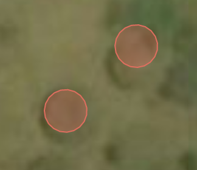


# Welcome to the Uganda Mapathon!

Firstly, thankyou for coming, each hut and road we add to this map could mean a new limb for someone who has been injured by conflict, so this is a great way to spend some time *(and get some pizza...!)*.

The following are just some brief instructions as to how to use the tools for the Mapathon:

## OpenStreetMap
First things first, you need to sign up with OpenStreetMap (or just login if you already have an account). Here is how:

1. If you are already a member of OpenStreetMap, click [**here**](https://www.openstreetmap.org/login) to log in and do so. *You can then skip the rest of this section. *
2. If you are not a member of OpenStreetMap, then click [**here**](https://www.openstreetmap.org/user/new) to sign up (also top right of the screen)
3. Fill in your details and click the **Sign Up** button at the bottom of the form, then accept the user agreement
4. You will then be sent an email asking you to verify your account
5. Click the link in the email and you are good to go!

## Huckathon.org (this website)
Huckathon.org is a simple tool to help us coordinate the mapping effort. In simple terms, we have divided the whole area that we are working in (in Uganda) into squares, and we are going to map those squares one by one (to make sure no-one maps anything twice!). Though it might seem a bit inefficient, the golden rule is this: **stick you your square!** This is the only way to avoid any wasted effort!!

The huckathon.org web page assigns you an orange square, and lets you quickly assess whether or not it needs mapping, simply by comparing satellite imagery to the current OpenStreetMap. 


We are only interested in mapping the following:

* Huts
* Buildings
* Roads / Tracks

Use the layer selector to flick between satellite photography and the OpenStreetMap (which is the map we are adding features to):


If there is nothing to map, or it has all already been mapped (i.e. it appears on OpenStreetMap), then you can press the red button, which will tell our database that this is the case.

If you are not sure *(e.g. there are clounds on the imagery, or you don't feel like you can make it out)*, you can simply press the orange button to simply move on to a new square

If you think that there is something in the orange square for you to map, click the green button, and this will open the **Map Editor** so that you can map it!


Basically, your though process would be something like this:

* Look at orange square, compare the satellite imagery to the OpenStreetMap, is there anything that needs mapping?
	* **Yes:** Click Green Button
	* **No:** Click Red Button
	* **Not Sure:** Click Orange Button

 
Don’t worry if you aren’t sure about the features, just ask one of the volunteers and they will be happy to help!

Remember, we only care about **Huts**, **Buildings** and **Roads / Tracks**.

Here are some examples:


The huts are particularly sneaky, so keep a good eye out!


And remember - we can't zoom in, so they might be pretty small..!


 
Be aware, the OpenStreetMap for areas that have not been mapped (either because they need mapping, or because there is nothing there) will look like this:


 
If you see this, remember that it means that nothing has been mapped yet - not that the tool is broken!! If there is something on the satellite image but not on the OpenStreetMap, then it needs mapping!!

It won’t always be as straightforward as this example, sometimes the areas will have been partially mapped, so maybe the roads have been digitised but not the buildings/huts. If you look at the OpenStreetMap layer and think that it is incomplete then go for it! *And if you aren’t sure, just ask!*

## Map Editor
If you have found features to map, and you have checked that they aren’t currently on OpenStreetMap and click the green button then a new tab will open in your browser containing OpenStreetMap's **Map Editor**.

If it asks you to log in then do so, and you will see a page like this: 


 
In this example the **road** has already been mapped but the **huts** and **buildings** have not. Let’s start by mapping the **huts**...

### Mapping a hut

1:	Zoom so you can see the huts clearly (it’s advisable to start in a corner and then work across from there so you don’t miss any). 
2:	When you can see a hut clearly then click the **Area** button at the top of the map: 



3:	Click around the outside of the hut to make a rough circle that roughly matches the shape of the hut *(it doesn't need to be perfect, just roughly is fine!)*, then double click to finish:



4:	Right click on the middle of your circle and select **Circularise** - this will make it into a perfect circle!



5:	On the left-hand tool bar there is a search box, type ‘Hut’ into that and then click the hut option that appears  



6:	Once you have finished either click the tick icon that is just to the left of the point button (and under the Export button) or just click anywhere on the map. *Well done you have successfully mapped your first Hut! *



7:	If there are several more huts of the same size, you can copy and paste that one by clicking on it (so it goes red with white dots around) and then pressing **Ctrl+C** then **Ctrl+V** on your keyboard. A new circular hut will then appear attached to your mouse pointer, and you can place it on the map by simply clicking where you want it. This allows you to quickly map all the huts in the village you have found, and saves you having to go through the above process again and again *(but only use this for ones that are the same size!!)*.



A video summary of the above points prepared by Patrick can be seen below: 

<iframe width="900" height="506" src="https://www.youtube.com/embed/5NMYcVEO0xI" frameborder="0" gesture="media" allow="encrypted-media" allowfullscreen></iframe>

### Mapping a building

To map buildings, follow the same method but instead of using **Circularise** simply follow the outline of the building and then select **'Building'** instead of ‘Hut’ from the bar on the left.

### Mapping a Road/Track

For ‘Roads’ and ‘Paths’ then you select the **Line** tool (instead of **Polygon**) and simply draw along the line in the same way as wit the huts. IN the left-hand bar, choose **Road** if it looks passable by a vehicle, and **Path** if not. If you aren’t sure whether it is a ‘Road’ or not, just ask!

### Deleting mistakes

If you make a mistake and would like to delete what you have drawn then simply click on it so it goes red, right click on it and then click the bin icon. Alternatively there is an undo button on at the top of the map (or just **Ctrl+Z**).



### Saving your work!!!

When you have mapped all the features in your area then it is time to save them to the OpenStreetMap database! To do this you click the **Save** button on the tool bar at the top of the map. The number next to it says how many things you have mapped!


This will make the map go grey and the bar on the left to look like this: 


 

In the **Changeset Comment** type (or just copy and paste): 

```
University of Manchester Mapathon 20/11/17
```

### Giving up...
If you want to give up on a square, or weren't able to finish, then that is absolutely fine - please just save any work that you have done (as above) then follow the instructions in the **Back to Huckathon.org** below so that we know to go back to that square.

## Back to Huckathon.org...

Well done and thank you, you have successfully mapped an area that has never been mapped before!! Now head back to the **Huckathon.org** tab which will now have different buttons. If you finished mapping your square then please click the big green button, if you didn’t finish then please click the red button: 



Either way, you will then be taken to a new square and you can start the process all over again!

Once again, thankyou again for taking part in the Mapathon - this is really important work that will change people's lives for the better!

## Ready? Let's Go! [Click here to get started...](./map.php)
